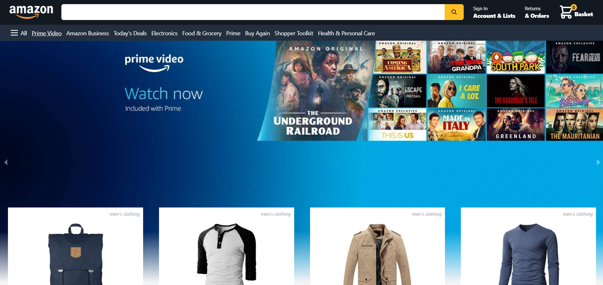
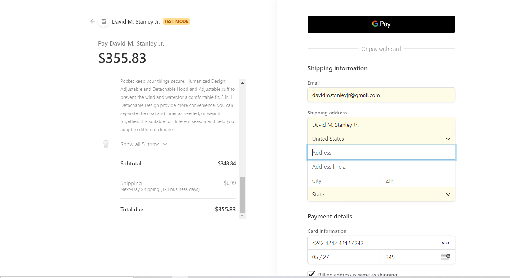
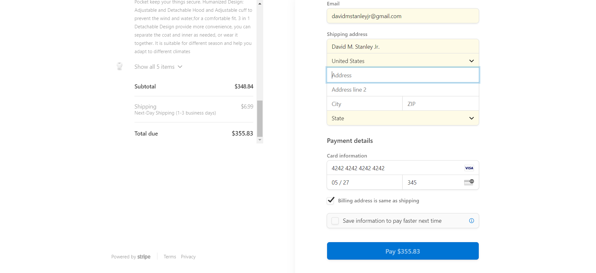
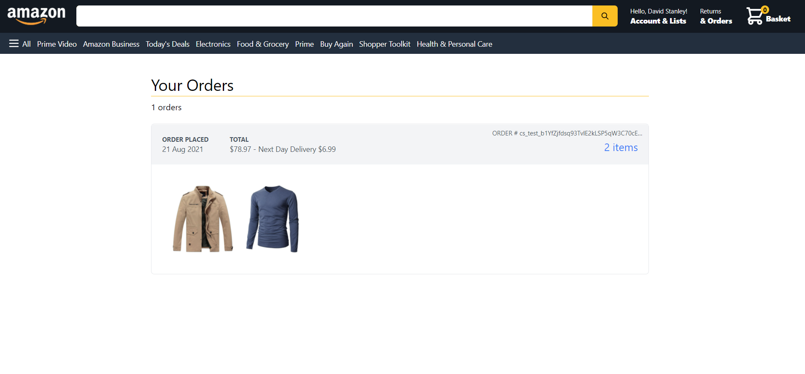
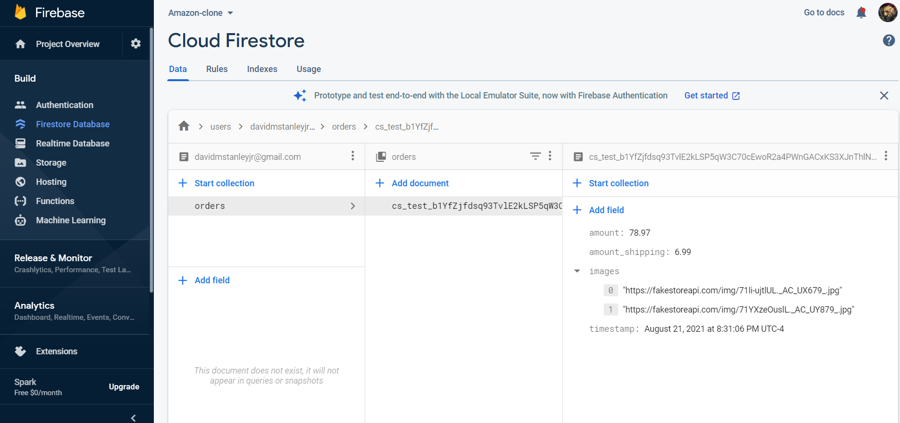
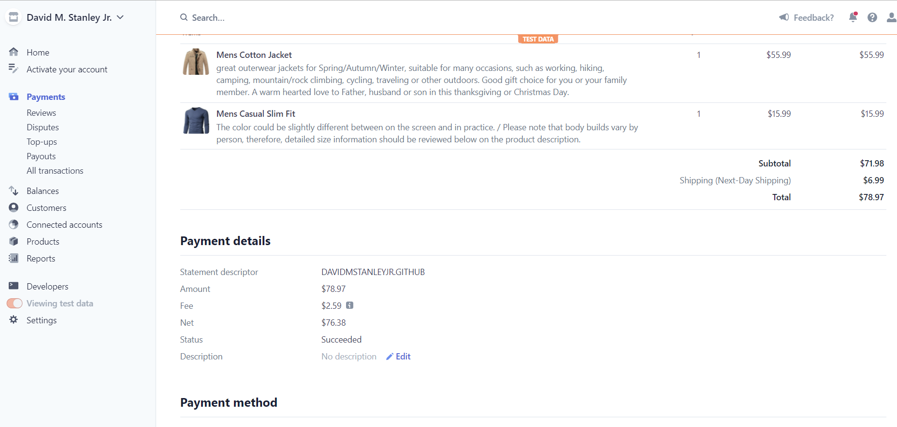
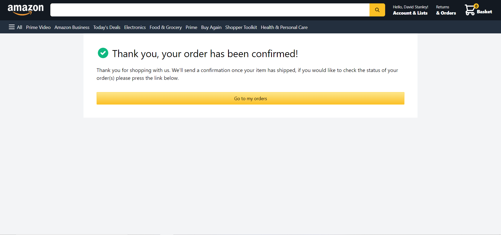

# Amazon-clone

This is my Amazon clone app and it's my second fully functional E-commerce application. I did this because I wanted to see if I could make an E-commerce application that resembled Amazon and I wanted to use a few different technologies that I've never used before. This project was very difficult but like all other difficult projects i've done, I grew from this.

# Environment Setup

1. Clone my repo at https://github.com/davidmstanleyjr/amazon-clone
2. CD into and type "npm install" in your terminal.
3. Then run "npm run dev" to open to run the project locally.

# Technologies Used

1. React
2. Hero Icons
3. Stripe
4. Stripe CLI
5. Tailwind CSS
6. Axios
7. Firebase
8. Firebase Admin
9. Micro
10. Moment
11. Next.JS
12. Next-Auth
13. React-Currency-Formatter
14. React DOM
15. React-Redux
16. React-Responsive-Carousel

# Issues

Like I said, this project was really difficult. Tailwind was fun to work with and made my application look great but the checkout page was really hard.

I had to use a webhook in order to get the checkout page to do what I wanted. I wanted to complete an order and go to a success page that had a link to the orders page so people could look at their orders.

However, Stripe has it's own innate way of doing things so I had to write a webhook. Implementing Stripe is always tough but if you do it right, it takes care of the rest. I didn't have to write any of the text you see in the checkout page, that's all done automatically by Stripe.

The last Stripe issue was getting the items to checkout successfully from my deployed site. It worked locally but not from the deployed site. I kept trying and trying and then I looked in my terminal and saw a message that said Stripe wouldn't work unless I fully activated my account. I typed in some personal details and then the checkouts went through successfully.

The last problem was Next-Auth. I wanted to use google to authenticate the site but a url would generate every time I re-deployed my app. I had to put that url into my Vercel environment variables and each time I did that, I would have to re-deploy which would generate a new url that I had to enter into my google dev console and into my Vercel environment variables. This created an endless annoying loop of me having to re-deploy and enter different environment variables. I solved this by creating a custom domain for my site in the Vercel settings, then I entered that domain into the environment variables for host and Next-Auth.

# Screenshots

# Live page

Here is a link to the deployed site https://davids-ecommerce-clone.vercel.app/

# Quick note

When you're checking out, feel free to use your real debit/credit card. It will show a successful payment but it won't take money from your account. This is because my Stripe account is in test mode and won't take your money. If you're not comfortable using your actual card, Stripe has a demo card number that they allow for testing purposes. Its 4242 4242 4242 4242. You can use that if you like and still successfully checkout.
